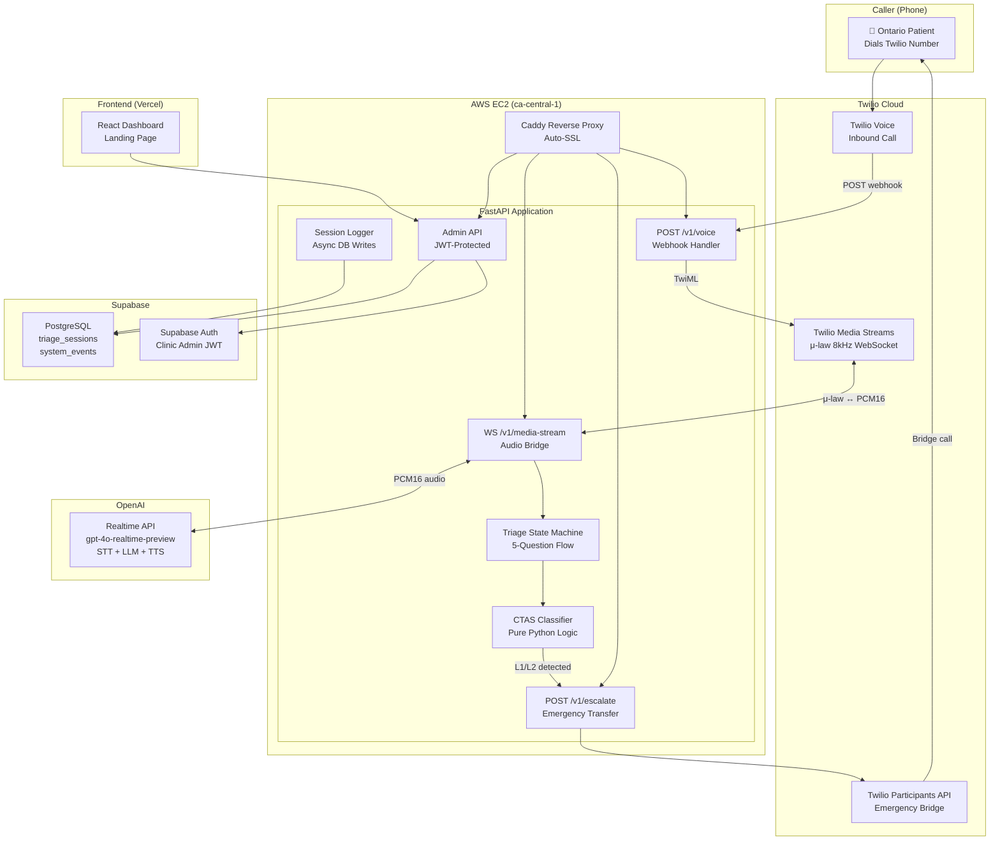

# TriageAI — System Architecture

## Architecture Decision: Modular Monolith

**Why not microservices**: Solo developer, <10K calls/month at 18mo. Microservices add network latency, deployment complexity, and distributed debugging overhead without benefit at this scale.

**Why not pure serverless**: WebSocket connections (Twilio Media Streams + OpenAI Realtime) require long-lived processes. Lambda's 15-minute timeout and cold starts are incompatible with real-time voice AI.

**Growth path**: Modules are isolated by directory with clean interfaces. When scale demands it, extract `voice/` or `triage/` as separate services without rewriting business logic.

## System Component Diagram



## Data Flow: Complete Triage Call

```
1. Patient dials Twilio number
2. Twilio sends POST /v1/voice webhook (with signature)
3. FastAPI validates signature → returns TwiML with <Stream> to /v1/media-stream
4. Twilio opens WebSocket → sends μ-law 8kHz audio frames
5. media_bridge.py converts μ-law → PCM16 16kHz via audioop
6. PCM16 forwarded to OpenAI Realtime API WebSocket
7. OpenAI processes speech → returns AI voice response
8. media_bridge.py converts OpenAI PCM16 → μ-law → sends to Twilio
9. Caller hears AI voice asking triage questions
10. State machine tracks progress through 5 CTAS questions
11. After Q5 (or early L1/L2 detection):
    a. classify_ctas() → deterministic CTAS Level (1-5)
    b. get_routing_action() → routing enum
    c. If L1/L2: POST /v1/escalate → Twilio bridges human agent
    d. If L3-L5: AI speaks routing message to caller
12. Session logger writes metadata to Supabase (async, no PII)
13. System events logged for PHIPA audit trail
```

## Module Responsibilities

| Module | Responsibility | Dependencies |
|:-------|:--------------|:-------------|
| `voice/` | Twilio webhook, WebSocket bridge, audio conversion | Twilio SDK, audioop |
| `triage/` | CTAS questions, state machine, classifier, system prompt | triage_config.json |
| `routing/` | Routing decision messages, resource lookup | triage_config.json |
| `escalation/` | Twilio warm transfer API call | Twilio REST client |
| `logging/` | Session creation/update, system events | SQLAlchemy async |
| `admin/` | Analytics endpoints, session list/detail | Supabase Auth JWT |
| `models/` | SQLAlchemy ORM table definitions | SQLAlchemy |

## Database Schema

```sql
-- Core session table (NO PII columns by design)
CREATE TABLE triage_sessions (
    id UUID PRIMARY KEY DEFAULT gen_random_uuid(),
    call_sid VARCHAR(64) UNIQUE NOT NULL,
    started_at TIMESTAMPTZ NOT NULL DEFAULT NOW(),
    ended_at TIMESTAMPTZ,
    duration_sec INTEGER,
    ctas_level INTEGER CHECK (ctas_level BETWEEN 1 AND 5),
    routing_action VARCHAR(32),  -- ENUM: escalate_911, er_urgent, walk_in, home_care, incomplete
    escalated BOOLEAN DEFAULT FALSE,
    escalation_ts TIMESTAMPTZ,
    questions_completed INTEGER DEFAULT 0,
    language_detected VARCHAR(5) DEFAULT 'en',
    created_at TIMESTAMPTZ DEFAULT NOW()
);

-- PHIPA audit trail
CREATE TABLE system_events (
    id UUID PRIMARY KEY DEFAULT gen_random_uuid(),
    session_id UUID REFERENCES triage_sessions(id),
    event_type VARCHAR(32) NOT NULL,
    -- ENUM: call_started, triage_started, question_answered,
    --       ctas_classified, escalation_triggered, call_ended
    metadata JSONB DEFAULT '{}',  -- NON-PII only
    created_at TIMESTAMPTZ DEFAULT NOW()
);

-- Routing resources (pre-seeded)
CREATE TABLE routing_resources (
    id UUID PRIMARY KEY DEFAULT gen_random_uuid(),
    resource_type VARCHAR(32),  -- walk_in, urgent_care, er, crisis_line
    name VARCHAR(128),
    city VARCHAR(64),
    phone VARCHAR(20),
    hours VARCHAR(128),
    created_at TIMESTAMPTZ DEFAULT NOW()
);

-- Indexes
CREATE INDEX idx_sessions_call_sid ON triage_sessions(call_sid);
CREATE INDEX idx_sessions_created_at ON triage_sessions(created_at);
CREATE INDEX idx_sessions_ctas_level ON triage_sessions(ctas_level);
CREATE INDEX idx_events_session_id ON system_events(session_id);
CREATE INDEX idx_events_created_at ON system_events(created_at);
```

## API Surface

| Endpoint | Method | Auth | Purpose |
|:---------|:-------|:-----|:--------|
| `GET /health` | GET | None | Liveness check |
| `POST /v1/voice` | POST | Twilio sig | Inbound call webhook |
| `WS /v1/media-stream` | WebSocket | Twilio | Bidirectional audio |
| `POST /v1/escalate` | POST | Twilio sig | Emergency warm transfer |
| `GET /v1/admin/analytics/summary` | GET | JWT | Dashboard stat cards |
| `GET /v1/admin/analytics/ctas-distribution` | GET | JWT | CTAS donut chart data |
| `GET /v1/admin/sessions` | GET | JWT | Paginated session list |
| `GET /v1/admin/session/{call_sid}` | GET | JWT | Session detail + events |

## Security Architecture

```
Internet → Cloudflare (DNS/CDN) → Caddy (Auto-SSL/HSTS) → FastAPI
                                                           ├── Twilio Signature Validation
                                                           ├── slowapi Rate Limiting
                                                           ├── Pydantic Input Validation
                                                           ├── Supabase Auth JWT Verification
                                                           └── structlog (no PII in logs)
```

**Key security decisions:**
- HTTPS everywhere via Caddy auto-SSL
- Twilio webhook signature validation on every inbound call
- Rate limiting: 20 req/min on `/v1/voice`, 5 req/min on `/v1/escalate`
- JWT stored in memory (not localStorage) for admin dashboard
- No PII stored — enforced at schema level (no columns for it)
