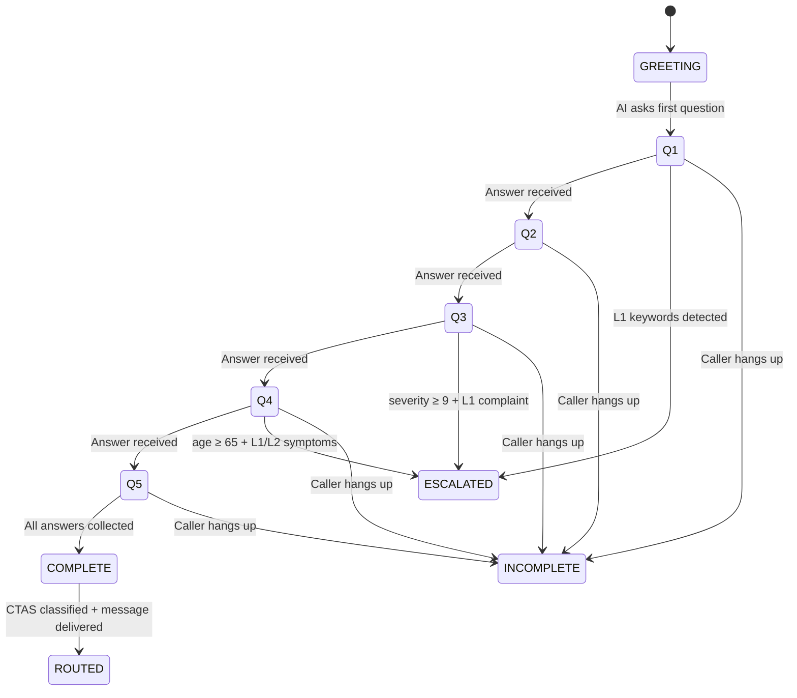

# TriageAI — CTAS Triage System

> Canadian Triage and Acuity Scale (CTAS) — 5-question structured classification → routing decision

## CTAS Levels

| Level | Name | Routing Action | Response Time | Example |
|:------|:-----|:---------------|:--------------|:--------|
| **L1** | Resuscitation | `ESCALATE_911` — Warm transfer NOW | Immediate | Chest pain + age 65+, can't breathe, "I need 911" |
| **L2** | Emergent | `ESCALATE_911` — Warm transfer | < 15 min | Worst headache of life, severe bleeding, stroke symptoms |
| **L3** | Urgent | `ER_URGENT` — Go to ER today | < 30 min | High fever + vomiting, severe abdominal pain |
| **L4** | Less Urgent | `WALK_IN` — Visit walk-in clinic | < 60 min | Moderate pain, minor injury, persistent cough |
| **L5** | Non-Urgent | `HOME_CARE` — Self-care advice | < 120 min | Mild cold, runny nose, minor skin rash |

## 5-Question Flow

```
Q1: "What's your main concern today?"
     → chief_complaint (free text, parsed for keywords)

Q2: "How long have you been experiencing this?"
     → duration_minutes (integer)

Q3: "On a scale of 1 to 10, how severe is this?"
     → severity (integer, 1-10)

Q4: "How old are you?"
     → age (integer)

Q5: "Do you have any existing medical conditions?"
     → conditions (list of strings)
```

## State Machine



### Implementation: `state_machine.py`

```python
from enum import Enum

class TriageState(Enum):
    GREETING = "greeting"
    Q1 = "chief_complaint"
    Q2 = "duration"
    Q3 = "severity"
    Q4 = "age"
    Q5 = "conditions"
    COMPLETE = "complete"
    ESCALATED = "escalated"
    INCOMPLETE = "incomplete"

class TriageSession:
    def __init__(self, call_sid: str):
        self.call_sid = call_sid
        self.state = TriageState.GREETING
        self.answers: dict = {}
        self.questions_completed = 0
    
    def advance_state(self) -> TriageState:
        """Move to the next question. Cannot advance past COMPLETE."""
        transitions = {
            TriageState.GREETING: TriageState.Q1,
            TriageState.Q1: TriageState.Q2,
            TriageState.Q2: TriageState.Q3,
            TriageState.Q3: TriageState.Q4,
            TriageState.Q4: TriageState.Q5,
            TriageState.Q5: TriageState.COMPLETE,
        }
        next_state = transitions.get(self.state)
        if next_state:
            self.state = next_state
            self.questions_completed += 1
        return self.state
    
    def is_complete(self) -> bool:
        return self.state == TriageState.COMPLETE
    
    def mark_incomplete(self):
        self.state = TriageState.INCOMPLETE
```

## Classifier: `classify_ctas()`

**This is a PURE FUNCTION — no LLM calls, deterministic, testable.**

```python
def classify_ctas(answers: dict) -> CTASLevel:
    """
    Maps triage answers to CTAS Level 1-5.
    
    CRITICAL RULE: When data is missing, classify UP not DOWN.
    A missed emergency is infinitely worse than a false alarm.
    """
    complaint = answers.get("chief_complaint", "").lower()
    severity = answers.get("severity")
    age = answers.get("age")
    duration = answers.get("duration_minutes")
    
    # L1 keywords — immediate escalation
    L1_KEYWORDS = ["chest pain", "can't breathe", "heart attack", 
                    "stroke", "unconscious", "not breathing", "911"]
    
    # Crisis keywords — always escalate
    CRISIS_KEYWORDS = ["kill myself", "suicide", "want to die"]
    
    if any(kw in complaint for kw in CRISIS_KEYWORDS):
        return CTASLevel.L1  # NEVER returns False
    
    if any(kw in complaint for kw in L1_KEYWORDS):
        if severity and severity >= 8:
            return CTASLevel.L1
        if age and age >= 65:
            return CTASLevel.L1
        return CTASLevel.L2
    
    # Missing data → conservative (L2)
    if severity is None or age is None:
        return CTASLevel.L2
    
    # Severity-based classification
    if severity >= 8:
        return CTASLevel.L2 if age >= 50 else CTASLevel.L3
    if severity >= 5:
        return CTASLevel.L3 if duration and duration < 120 else CTASLevel.L4
    
    return CTASLevel.L5
```

## Early Escalation: `should_escalate_early()`

**Most safety-critical function in the entire system.**

```python
def should_escalate_early(state: TriageState, partial_answers: dict) -> bool:
    """
    Check if L1/L2 symptoms detected even before all 5 questions answered.
    This fires IMMEDIATELY — does not wait for remaining questions.
    """
    complaint = partial_answers.get("chief_complaint", "").lower()
    severity = partial_answers.get("severity")
    
    # Any crisis keyword = immediate escalation
    if any(kw in complaint for kw in CRISIS_KEYWORDS):
        return True
    
    # Caller says "I need 911" = immediate
    if "911" in complaint or "emergency" in complaint:
        return True
    
    # L1 keywords + high severity = escalate before Q5
    if any(kw in complaint for kw in L1_KEYWORDS):
        if severity and severity >= 9:
            return True
        if partial_answers.get("age", 0) >= 65:
            return True
    
    return False
```

## Routing Action: `get_routing_action()`

```python
class RoutingAction(Enum):
    ESCALATE_911 = "escalate_911"
    ER_URGENT = "er_urgent"
    WALK_IN = "walk_in"
    HOME_CARE = "home_care"
    INCOMPLETE = "incomplete"

def get_routing_action(ctas_level: int) -> RoutingAction:
    """Map CTAS level to routing action. Raises ValueError for invalid levels."""
    if not isinstance(ctas_level, int):
        raise TypeError(f"CTAS level must be int, got {type(ctas_level)}")
    
    mapping = {
        1: RoutingAction.ESCALATE_911,
        2: RoutingAction.ESCALATE_911,
        3: RoutingAction.ER_URGENT,
        4: RoutingAction.WALK_IN,
        5: RoutingAction.HOME_CARE,
    }
    
    if ctas_level not in mapping:
        raise ValueError(f"Invalid CTAS level: {ctas_level}. Must be 1-5.")
    
    return mapping[ctas_level]
```

## triage_config.json Spec

```json
{
  "questions": {
    "chief_complaint": {
      "key": "chief_complaint",
      "text": "What's your main concern today?",
      "follow_up_prompt": "Can you tell me more about what you're experiencing?",
      "validation_type": "free_text"
    },
    "duration": {
      "key": "duration_minutes",
      "text": "How long have you been experiencing this?",
      "validation_type": "duration"
    },
    "severity": {
      "key": "severity",
      "text": "On a scale of 1 to 10, how severe is this?",
      "validation_type": "integer_range",
      "min": 1, "max": 10
    },
    "age": {
      "key": "age",
      "text": "How old are you?",
      "validation_type": "integer_range",
      "min": 0, "max": 120
    },
    "conditions": {
      "key": "conditions",
      "text": "Do you have any existing medical conditions?",
      "validation_type": "free_text_list"
    }
  },
  "routing_messages": {
    "escalate_911": "This sounds like a medical emergency. Connecting you to a nurse right now. Please stay on the line.",
    "er_urgent": "This sounds urgent. Please go to an emergency room today. Do not wait.",
    "walk_in": "I recommend visiting a walk-in clinic today. You can find one near you at 811.ca.",
    "home_care": "This doesn't appear to be an emergency. Consider rest and over-the-counter remedies. If symptoms worsen, call back or visit a walk-in clinic."
  },
  "l1_keywords": ["chest pain", "can't breathe", "heart attack", "stroke", "unconscious", "not breathing"],
  "crisis_keywords": ["kill myself", "suicide", "want to die", "end my life"]
}
```

## System Prompt: `prompts.py`

Key requirements for the GPT-4o system prompt:
- **PIPEDA consent disclosure** in greeting (verbatim)
- **Never diagnose** — use "sounds like" / "based on what you've told me"
- **No medical jargon** — plain language only
- **No bullet points** in responses — TTS-optimized short sentences
- **Redirect prompt injection** — "Let's focus on getting you the right care."
- **5 questions in order** — follow the `triage_config.json` sequence
