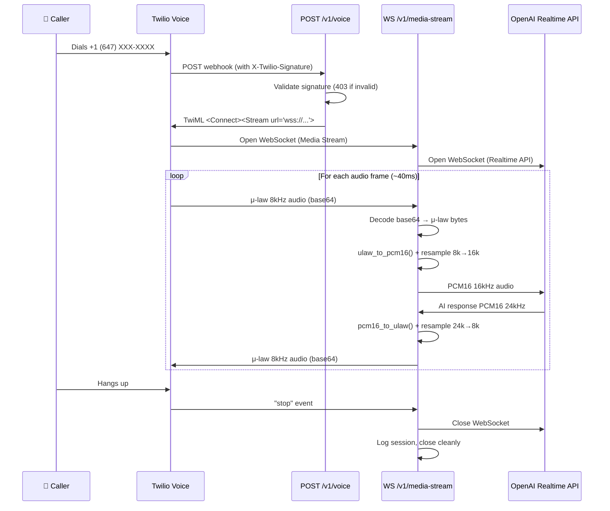

# TriageAI — Voice Pipeline

> Twilio ↔ FastAPI ↔ OpenAI Realtime API bidirectional audio bridge

## Overview

The voice pipeline is the core of TriageAI. It creates a real-time, bidirectional audio bridge between a phone caller (via Twilio) and an AI voice agent (via OpenAI Realtime API). The entire conversation happens over WebSockets with audio format conversion in between.

## Connection Architecture



## Audio Format Conversion

### Twilio → OpenAI (Inbound Audio)

| Step | Input | Output | Tool |
|:-----|:------|:-------|:-----|
| 1. Decode | Base64 string | μ-law bytes | `base64.b64decode()` |
| 2. Convert | μ-law 8kHz | PCM16 linear 8kHz | `audioop.ulaw2lin(data, 2)` |
| 3. Resample | PCM16 8kHz | PCM16 16kHz | `audioop.ratecv(data, 2, 1, 8000, 16000, None)` |

### OpenAI → Twilio (Outbound Audio)

| Step | Input | Output | Tool |
|:-----|:------|:-------|:-----|
| 1. Resample | PCM16 24kHz | PCM16 8kHz | `audioop.ratecv(data, 2, 1, 24000, 8000, None)` |
| 2. Convert | PCM16 linear 8kHz | μ-law 8kHz | `audioop.lin2ulaw(data, 2)` |
| 3. Encode | μ-law bytes | Base64 string | `base64.b64encode()` |

### Key Implementation: `audio_utils.py`

```python
import audioop
import base64

def ulaw_to_pcm16(ulaw_frame: bytes) -> bytes:
    """Convert Twilio μ-law 8kHz to PCM16 16kHz for OpenAI."""
    if not ulaw_frame:
        return b''
    pcm = audioop.ulaw2lin(ulaw_frame, 2)
    pcm_16k, _ = audioop.ratecv(pcm, 2, 1, 8000, 16000, None)
    return pcm_16k

def pcm16_to_ulaw(pcm_frame: bytes) -> bytes:
    """Convert OpenAI PCM16 24kHz to μ-law 8kHz for Twilio."""
    if not pcm_frame:
        return b''
    pcm_8k, _ = audioop.ratecv(pcm_frame, 2, 1, 24000, 8000, None)
    return audioop.lin2ulaw(pcm_8k, 2)
```

## Twilio Media Stream Protocol

Twilio sends JSON messages over the WebSocket:

```json
// Connection start
{"event": "start", "streamSid": "MZxxx", "start": {"callSid": "CAxxx", "mediaFormat": {"encoding": "audio/x-mulaw", "sampleRate": 8000}}}

// Audio frame (~every 20ms)
{"event": "media", "media": {"payload": "<base64 audio>"}}

// Connection end
{"event": "stop"}
```

**Handle all 3 message types.** Ignore unknown event types gracefully.

## OpenAI Realtime API Protocol

```python
# Connection setup
ws = await websockets.connect(
    "wss://api.openai.com/v1/realtime?model=gpt-4o-realtime-preview",
    extra_headers={
        "Authorization": f"Bearer {OPENAI_API_KEY}",
        "OpenAI-Beta": "realtime=v1"
    }
)

# Session configuration (send immediately after connect)
await ws.send(json.dumps({
    "type": "session.update",
    "session": {
        "voice": "alloy",
        "instructions": system_prompt,  # From prompts.py
        "input_audio_format": "pcm16",
        "output_audio_format": "pcm16",
        "turn_detection": {"type": "server_vad"}
    }
}))

# Send audio frames
await ws.send(json.dumps({
    "type": "input_audio_buffer.append",
    "audio": base64.b64encode(pcm16_frame).decode()
}))

# Receive AI audio response
# Listen for: "response.audio.delta" events
# Each contains base64 PCM16 audio to convert and send to Twilio
```

## Performance Requirements

| Metric | Target | Why |
|:-------|:-------|:----|
| First AI word | < 3 seconds after call connects | User experience — silence = bug |
| Webhook response | < 200ms | Twilio has 5-second timeout |
| Audio frame latency | < 100ms per frame | Perceptible delay above 150ms |
| WebSocket stability | 5+ minutes continuous | Full triage call duration |
| Memory per call | < 50MB | Avoid container OOM |

## Connection Lifecycle Management

**Critical: Both WebSocket connections MUST close when a call ends.**

```python
async def handle_media_stream(websocket: WebSocket):
    openai_ws = None
    try:
        await websocket.accept()
        openai_ws = await connect_to_openai()
        
        async for message in websocket.iter_json():
            if message["event"] == "start":
                call_sid = message["start"]["callSid"]
                # Create session in DB
            elif message["event"] == "media":
                audio = base64.b64decode(message["media"]["payload"])
                pcm16 = ulaw_to_pcm16(audio)
                await forward_to_openai(openai_ws, pcm16)
            elif message["event"] == "stop":
                break  # Clean exit
    finally:
        # ALWAYS clean up — prevent memory leaks
        if openai_ws:
            await openai_ws.close()
        # Log session completion
```

## Common Pitfalls

| Issue | Symptom | Fix |
|:------|:--------|:----|
| Garbled audio | Static/noise on call | Check byte order in `audioop.ulaw2lin()` — must use sample width 2 |
| One-way audio | Caller hears nothing | OpenAI audio format mismatch — verify `pcm16` not `g711_ulaw` |
| Dangling WebSocket | Memory leak over time | Always close OpenAI WS in `finally` block |
| Twilio 5s timeout | Call drops immediately | Webhook response must be < 200ms — no blocking I/O in handler |
| Frame size mismatch | Choppy audio | Buffer 40ms of audio before forwarding (320 bytes at 8kHz) |
